# Senario Builder
An integrated system to manage serif data.
In my portfolio site, I implemented to serif system to enable my charactors to talk like a novel game.
I thought it's very interesting to install some characters in interactions with users and I'd like a generic serif management platform to make web systems facinating.

## Outline

1. Register the serif data in control panel.
1. Transfer the serif data via API to outer system
1. Use the serif data in the systems like chatbot.

## Technology
- ASP.NET Core MVC
- Azure Functions
- Docker
- SQL Server
- Azure Blob

## Future Problem
- Defferentiation form existing chatbot platforms.